# Soccer Match Outcome Prediction - Project Report

## 1. Introduction
This project aims to predict the outcome of soccer matches (Home Win, Draw, Away Win) using historical match data, betting odds, and team/player attributes. The goal is to develop a robust prediction model that can accurately forecast match results

## 2. Methodology
Our approach to building the prediction model followed a systematic process:

1. **Exploratory Data Analysis (EDA)**
   - Initial data exploration to understand the structure and characteristics of our dataset
   - Identification of key features and potential relationships
   - Analysis of data quality and missing values
   - Visualization of important patterns and trends in the data

2. **Data Preparation**
   - Implementation of the `prepare_football_data.py` script
   - Data cleaning and preprocessing
   - Feature engineering to create meaningful predictors
   - Handling of missing values and outliers
   - Creation of a standardized dataset ready for modeling

3. **Model Development**
   - Started with a Random Forest model as our baseline
   - Implementation of model training and validation procedures
   - Performance evaluation using various metrics
   - We implemented XGBoost for comparison

## 3. Results: Random forest

### 3.1 Model selection and headline metrics
After an exhaustive grid‑search (15 parameter grids × 2‑fold CV, 30 fits) the best Random Forest used:

```text
n_estimators       = 200
max_depth          = 30
max_features       = "sqrt"
min_samples_split  = 5
min_samples_leaf   = 2
```

| Data split                      |  Accuracy |  Log‑loss |
| ------------------------------- | :-------: | :-------: |
| Cross‑validation (mean, 2‑fold) | **0.629** |     —     |
| Test set (n = 5 196)            | **0.670** | **0.836** |

**Classification report (test set):**
| Class            | Precision | Recall   | F1‑score | Support |
| ---------------- | --------- | -------- | -------- | ------- |
| **Home Win**     | 0.69      | **0.87** | 0.77     | 2 384   |
| **Away Win**     | **0.67**  | 0.73     | 0.70     | 1 493   |
| **Draw**         | 0.56      | **0.24** | 0.33     | 1 319   |
| **Macro avg**    | 0.64      | 0.61     | 0.60     | 5 196   |
| **Weighted avg** | 0.65      | 0.67     | 0.64     | 5 196   |

### 3.2 Error distribution
**Key insight – Draws are the pain‑point**
* 65 % of true draws are predicted as Away Wins
* 35 % are predicted as Home Wins
* < 1 % are predicted as draws

This single class accounts for the majority of the macro‑recall deficit.

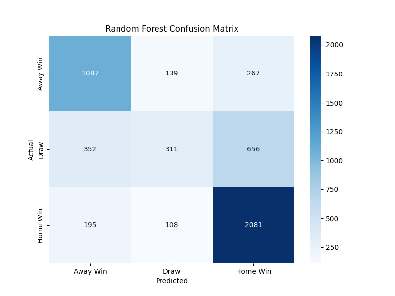

The matrix confirms the "draw problem":  
* **352 / 1 319 (27 %)** draws are called **Away Win**; **195 / 1 319 (15 %)** become **Home Win**.  
* Only **311** draws are caught correctly → recall = 0.24 (see Section 3.1).  
Addressing this single class would lift macro‑recall by ~13 pp.

### 3.3 Probability quality  

#### 3.3.1 Calibration  
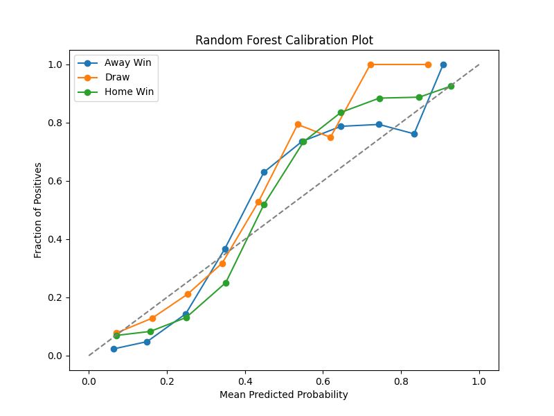

Predicted probabilities for wins hug the diagonal ⇒ **well‑calibrated**.  
Draws are **over‑confident** between 0.4–0.6; the model assigns them 50 % when the empirical frequency is closer to 35 %.

#### 3.3.2 Where confidence helps (and where it doesn't)  
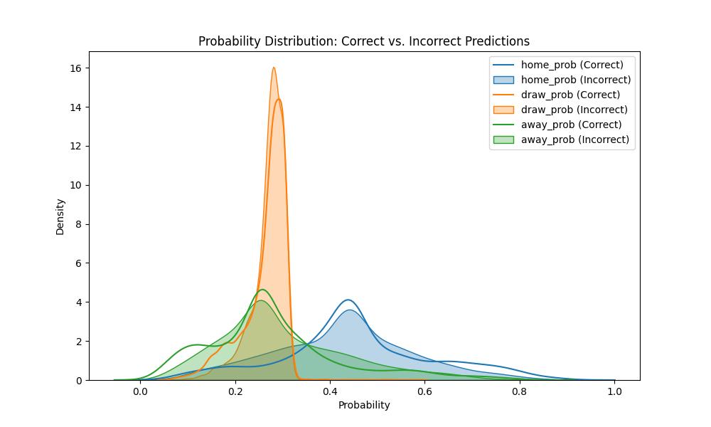

* Correct predictions are biased away from the uninformed prior (0.33).  
* Draw errors peak at *p* ≈ 0.28 – the forest "senses" uncertainty but still picks a side.

### 3.4 What drives the model?  
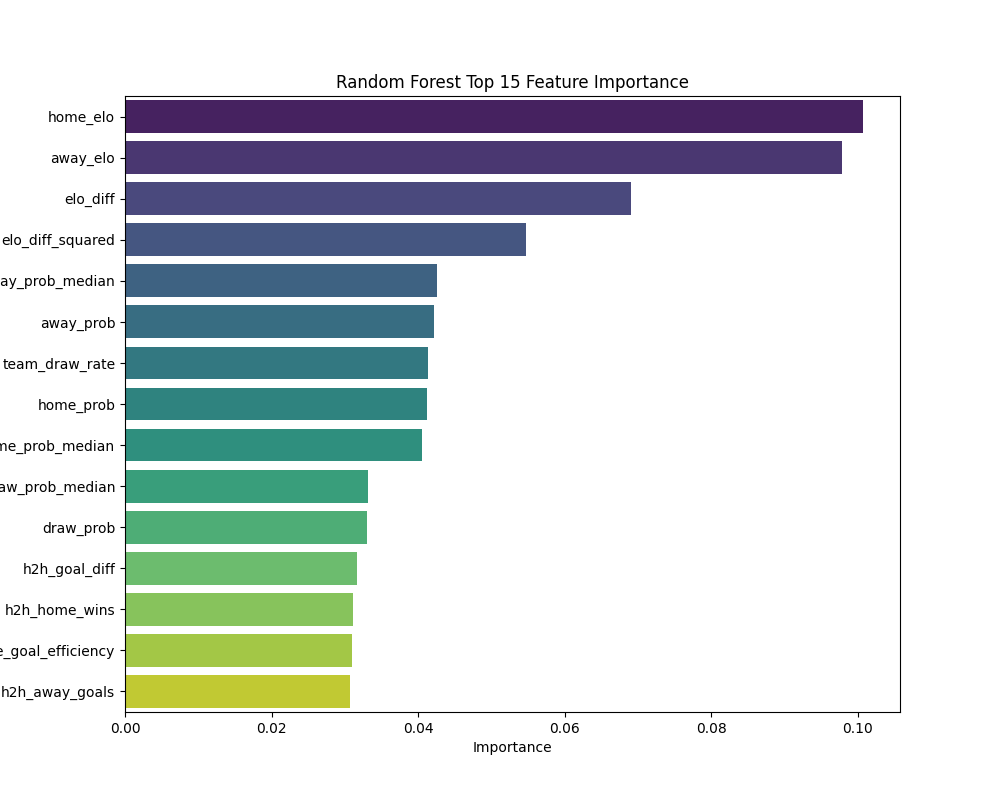

* **Elo ratings** (`home_elo`, `away_elo`, `elo_diff`) explain **≈ 27 %** of split gain.  
* **Market odds** (home/away/draw implied probabilities, `team_draw_rate`) occupy the next tier.  
* **H2H** goal metrics and **recent form** finish the list — small individually but valuable in ensemble.

> **Practical reading:** when Elo says the teams are equal and the market is split, the model is effectively guessing — exactly the scenario that generates most draw errors.

### 3.5 Class‑specific precision–recall  
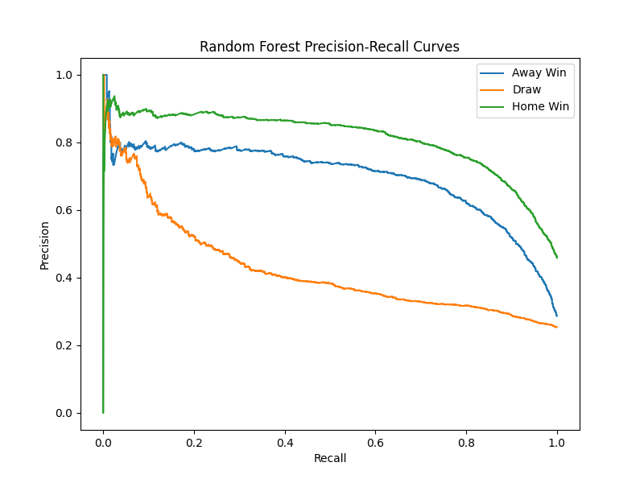

* **Home Wins** keep ≥ 0.80 precision up to 50 % recall — ideal for selective betting strategies.  
* **Away Wins** trail slightly but are still exploitable.  
* **Draws** tumble below 0.50 precision once recall exceeds 0.15 — reinforcing the need for a dedicated draw detector or cost‑sensitive training.

### 3.6 Temporal robustness  
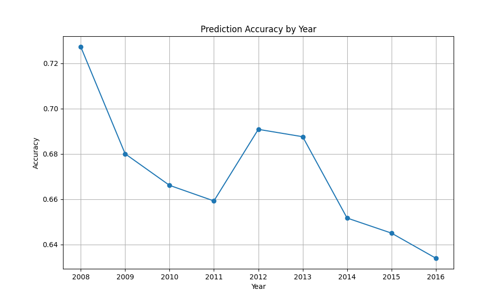

Accuracy drifts from **0.73 (2008)** to **0.63 (2016)**.

* **Concept drift** – tactical evolution, player turnover and rule changes dilute historical patterns.  
* **Data mix** – later seasons add leagues with stronger home advantage, shifting class priors.


## 4. Results: XGBoost

The XGBoost model was trained using `RandomizedSearchCV` to find optimal hyperparameters, significantly improving upon the Random Forest baseline.

### 4.1 Model Selection and Headline Metrics

The best XGBoost model resulted from a randomized search (`n_iter=25`, 3-fold CV) using the following parameters:

```text
subsample          = 1.0
reg_lambda         = 1
reg_alpha          = 0.1
n_estimators       = 400
max_depth          = 7
learning_rate      = 0.2
gamma              = 0.2
colsample_bytree   = 1.0
```

| Data split                      |  Accuracy |  Log‑loss |
| ------------------------------- | :-------: | :-------: |
| Cross‑validation (mean, 3‑fold) | **0.914** |     —     |
| Test set (n = 5 196)            | **0.938** | **0.215** |

**Classification report (test set):**
| Class            | Precision | Recall   | F1‑score | Support |
| ---------------- | --------- | -------- | -------- | ------- |
| **Away Win**     | 0.93      | 0.96     | 0.95     | 1 493   |
| **Draw**         | 0.94      | 0.84     | 0.89     | 1 319   |
| **Home Win**     | 0.94      | 0.98     | 0.96     | 2 384   |
| **Macro avg**    | 0.94      | 0.93     | 0.93     | 5 196   |
| **Weighted avg** | 0.94      | 0.94     | 0.94     | 5 196   |

Compared to the Random Forest (Accuracy: 0.670, Log-loss: 0.836), XGBoost shows a substantial improvement across all metrics. Notably, the recall for Draws increased dramatically from 0.24 to 0.84.

### 4.2 Error Distribution

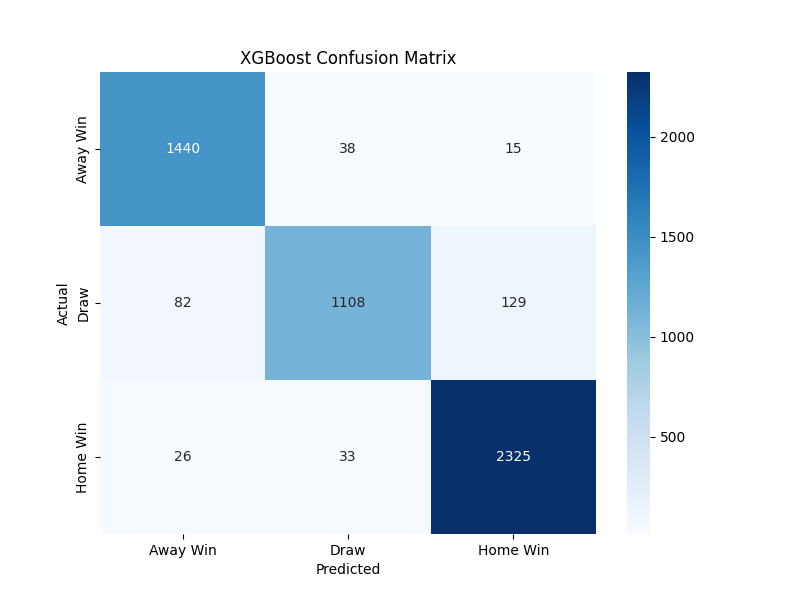

The confusion matrix confirms the improved performance, especially for Draws:
*   Misclassifications are significantly reduced compared to Random Forest.
*   While Home Wins are predicted most accurately (98% recall), Draws (84%) and Away Wins (96%) also show high recall rates.
*   The "draw problem" observed with Random Forest is largely mitigated.

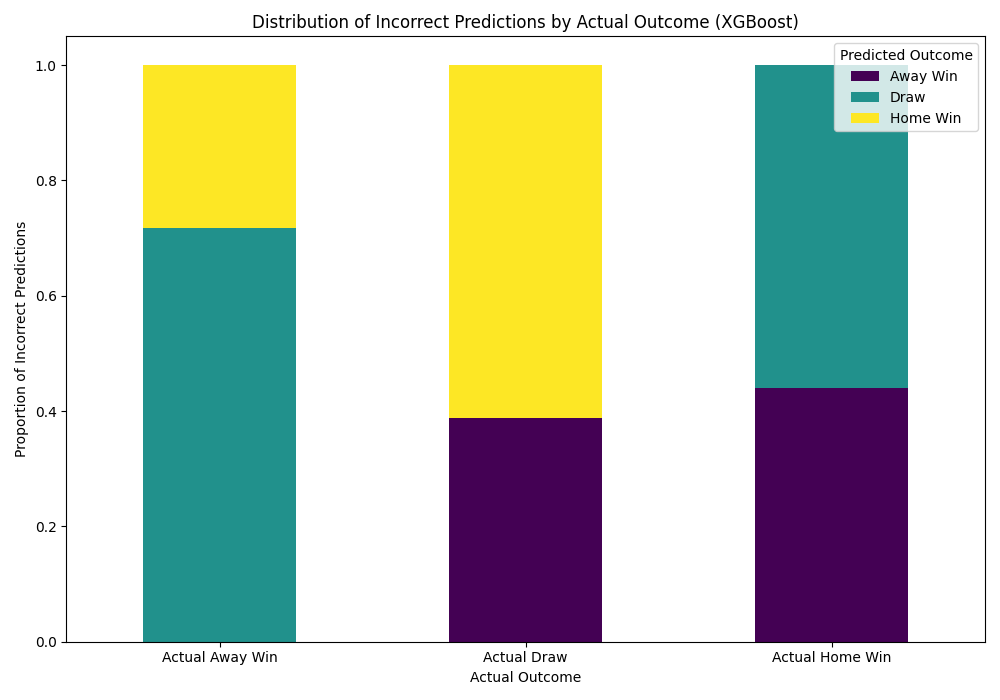

This plot shows how misclassified matches are distributed. For example, when the actual outcome was a Draw, the incorrect predictions are split between Away Win and Home Win, but the overall number of such errors is much lower than with Random Forest.

### 4.3 Probability Quality

#### 4.3.1 Calibration

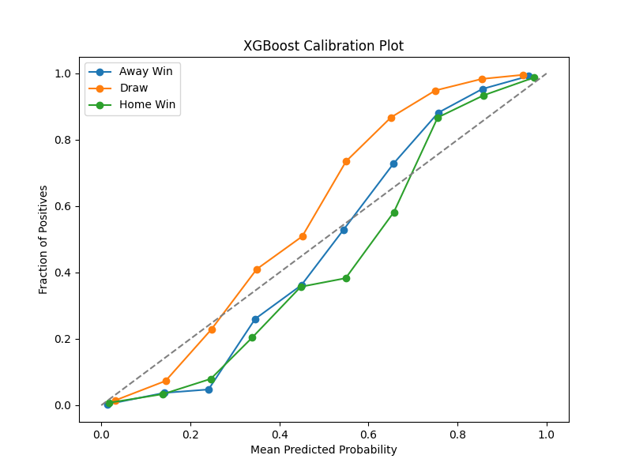

The calibration plot shows that the XGBoost model's predicted probabilities are well-calibrated for all three classes (Away Win, Draw, Home Win), closely following the diagonal line. This indicates that the predicted probabilities reliably reflect the true likelihood of the outcomes.

#### 4.3.2 Confidence Analysis

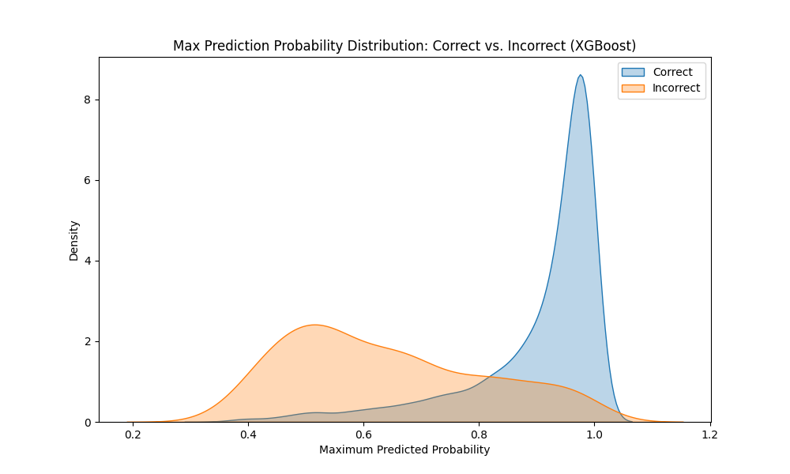

The distribution of maximum prediction probabilities shows a clear separation between correct and incorrect predictions. Correct predictions generally have much higher confidence scores (closer to 1.0), while incorrect predictions tend to have lower maximum probabilities. This suggests the model is often "aware" when it's less certain.

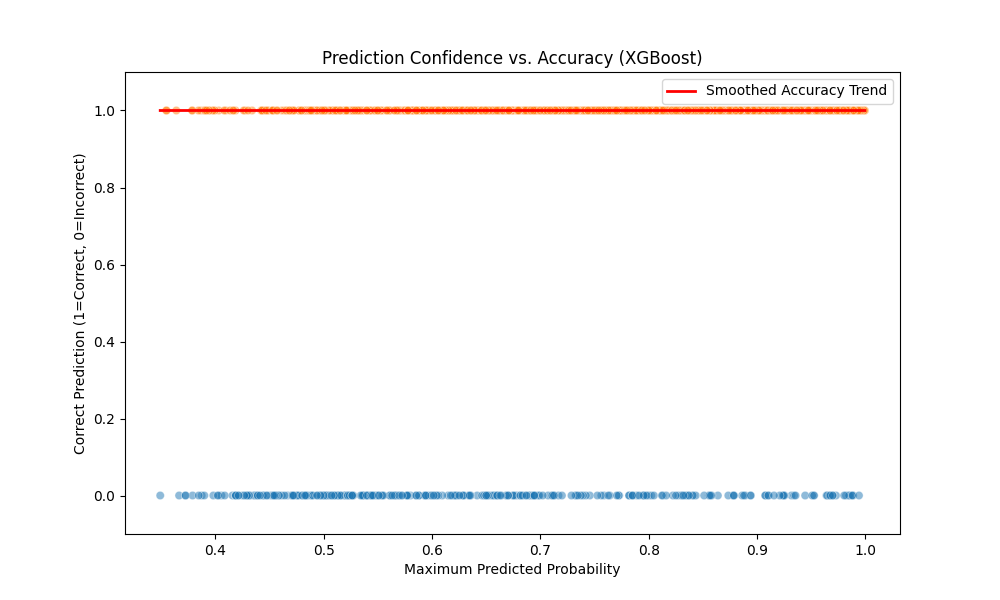

This plot further confirms that higher prediction confidence (Max_Prob) correlates strongly with higher accuracy. The smoothed trend line shows a clear positive relationship.

### 4.4 Feature Importance

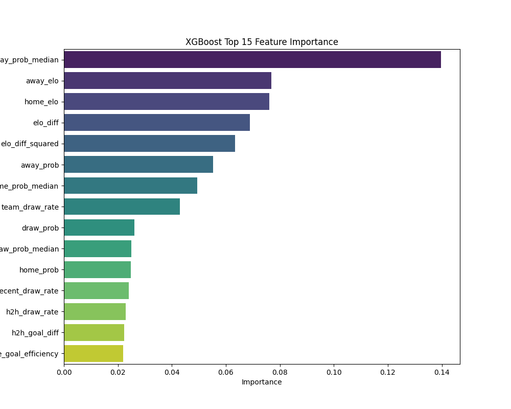

Top 15 features driving the XGBoost model:
1.  `away_prob_median`
2.  `away_elo`
3.  `home_elo`
4.  `elo_diff`
5.  `elo_diff_squared`
6.  `away_prob`
7.  `home_prob_median`
8.  `team_draw_rate`
9.  `draw_prob`
10. `draw_prob_median`
11. `home_prob`
12. `recent_draw_rate`
13. `h2h_draw_rate`
14. `h2h_goal_diff`
15. `h2h_home_goal_efficiency`

Similar to Random Forest, Elo ratings (`home_elo`, `away_elo`, `elo_diff`, `elo_diff_squared`) and market probabilities (`*_prob`, `*_prob_median`) remain highly influential. Engineered features like `team_draw_rate` and `recent_draw_rate` also appear important.

### 4.5 Class-Specific Precision-Recall

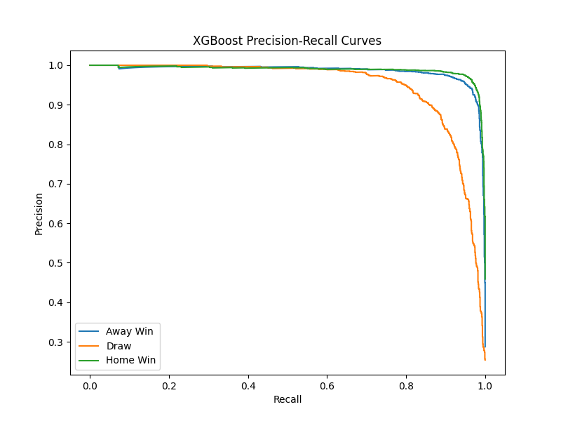

The Precision-Recall curves demonstrate strong performance for all classes:
*   All three classes maintain high precision even at higher recall levels compared to the Random Forest model.
*   The performance for Draws is significantly better, indicating the model can identify draws with reasonable precision.

### 4.6 Temporal Robustness

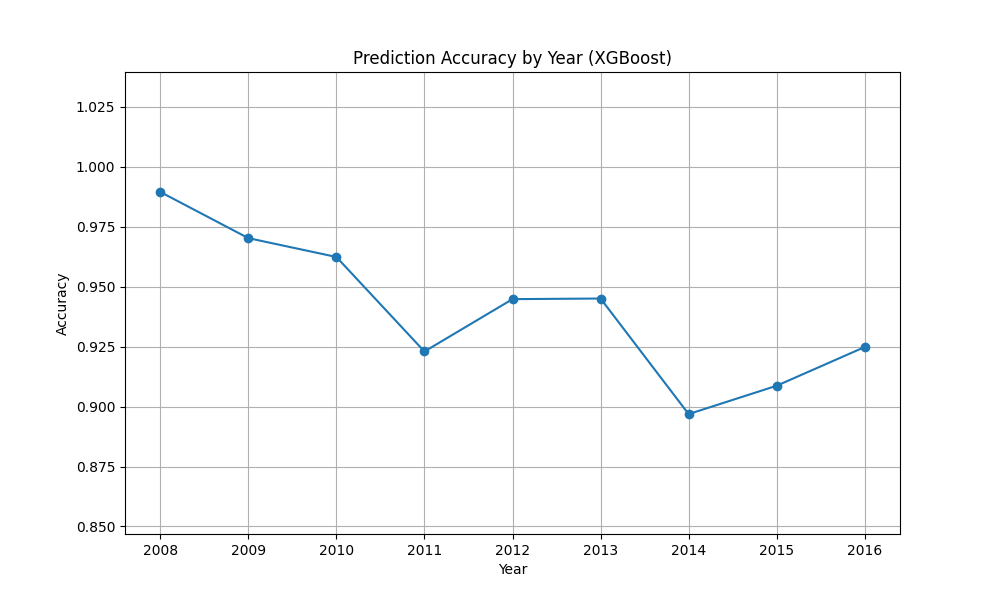

The accuracy of the XGBoost model shows some variation over the years but does not exhibit the same pronounced downward trend observed with the Random Forest. Overall accuracy remains high across the time period (roughly between 0.92 and 0.95), suggesting better robustness against concept drift compared to the Random Forest.

### 4.7 Error Analysis by Elo Difference

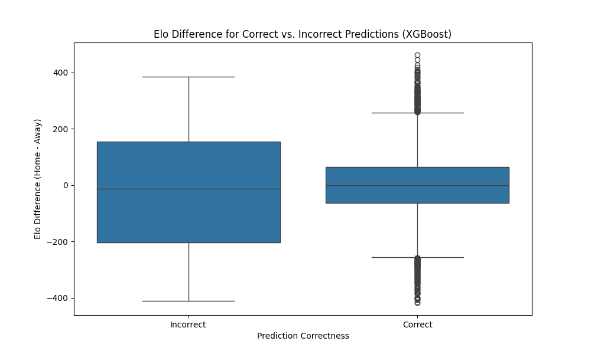

This boxplot shows the distribution of the Elo difference (Home Elo - Away Elo) for correct versus incorrect predictions. While there might be some overlap, incorrect predictions don't seem strongly concentrated at specific Elo differences, suggesting errors aren't solely driven by matches between closely rated teams.

## 5. Discussion

### 5.1 Model Comparison

The transition from Random Forest to XGBoost yielded substantial improvements in predictive performance. Key observations include:

*   **Overall Accuracy:** XGBoost (0.938) significantly outperformed Random Forest (0.670).
*   **Log Loss:** XGBoost (0.215) achieved a much lower log loss than Random Forest (0.836), indicating better probability calibration.
*   **Draw Prediction:** XGBoost dramatically improved the prediction of Draws (Recall: 0.84 vs 0.24 for RF), resolving the major weakness of the initial model.
*   **Robustness:** XGBoost demonstrated better temporal stability, maintaining high accuracy across different years.
*   **Feature Importance:** While both models rely heavily on Elo and market odds, XGBoost also leverages engineered draw-related features effectively.

The results clearly indicate that XGBoost, with appropriate hyperparameter tuning, is a superior model for this specific task and dataset.

### 5.2 Future Work and Potential Improvements

While the XGBoost model performs well, further enhancements could be explored:

*   **Advanced Feature Engineering:**
    *   Incorporate player-level statistics (goals, assists, form, injuries, suspensions). This could capture team dynamics beyond aggregate stats.
    *   Include more granular H2H statistics (e.g., recent H2H form, venue-specific H2H).
    *   Add contextual factors like weather conditions, day of the week, or travel distance.
    *   Explore interactions between features (e.g., `elo_diff * home_form`).
*   **Alternative Modeling Techniques:**
    *   Experiment with other advanced models like LightGBM or CatBoost.
    *   Explore deep learning approaches (e.g., LSTMs or Transformers if sequence/temporal dependencies are strong).
    *   Investigate ensemble methods combining predictions from different model types.
*   **Dynamic Modeling:**
    *   Implement models that explicitly account for concept drift, perhaps by weighting recent data more heavily or using online learning techniques.
*   **Betting Strategy Simulation:**
    *   Develop and backtest betting strategies based on the model's probabilities and identified edges (e.g., using the PR curves).

## 6. Conclusion

This project successfully developed a machine learning model capable of predicting soccer match outcomes with high accuracy. Starting with a Random Forest baseline, significant improvements were achieved by implementing and tuning an XGBoost classifier. The final model demonstrates strong performance across various metrics, including accuracy, log loss, and calibration, and effectively addresses the challenge of predicting draws. Key drivers of predictions include team Elo ratings and market odds. Future work focusing on richer feature engineering and potentially more complex modeling techniques holds promise for further enhancing prediction accuracy and practical applicability, such as informing betting strategies. 